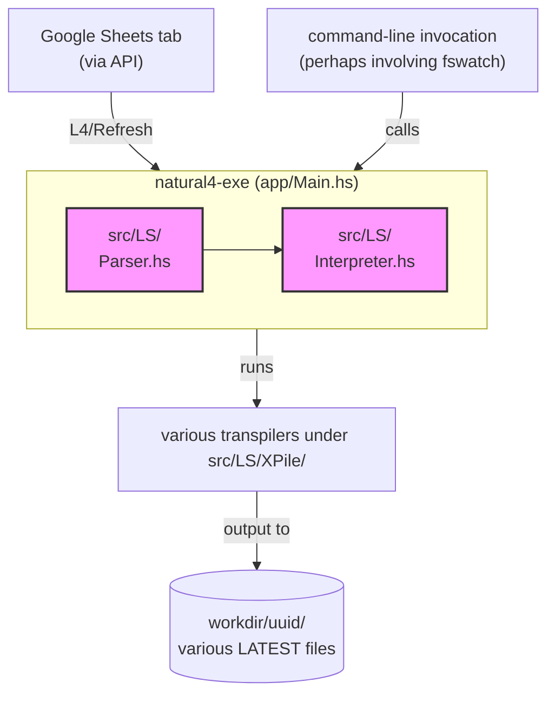
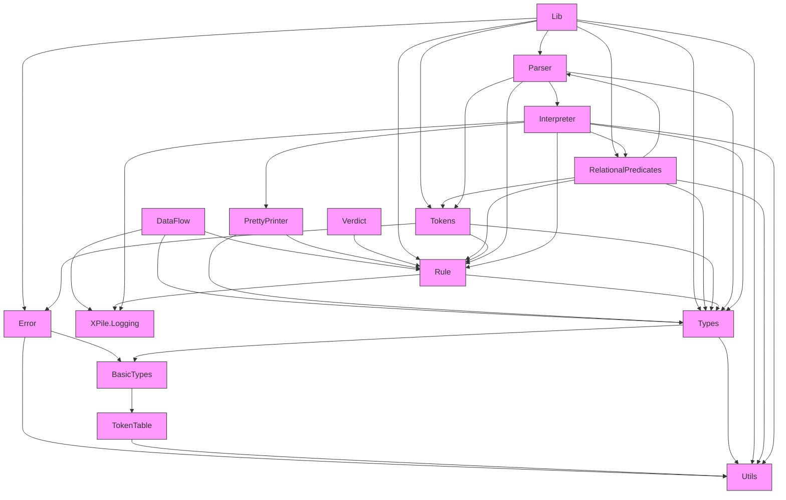
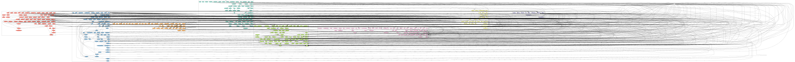
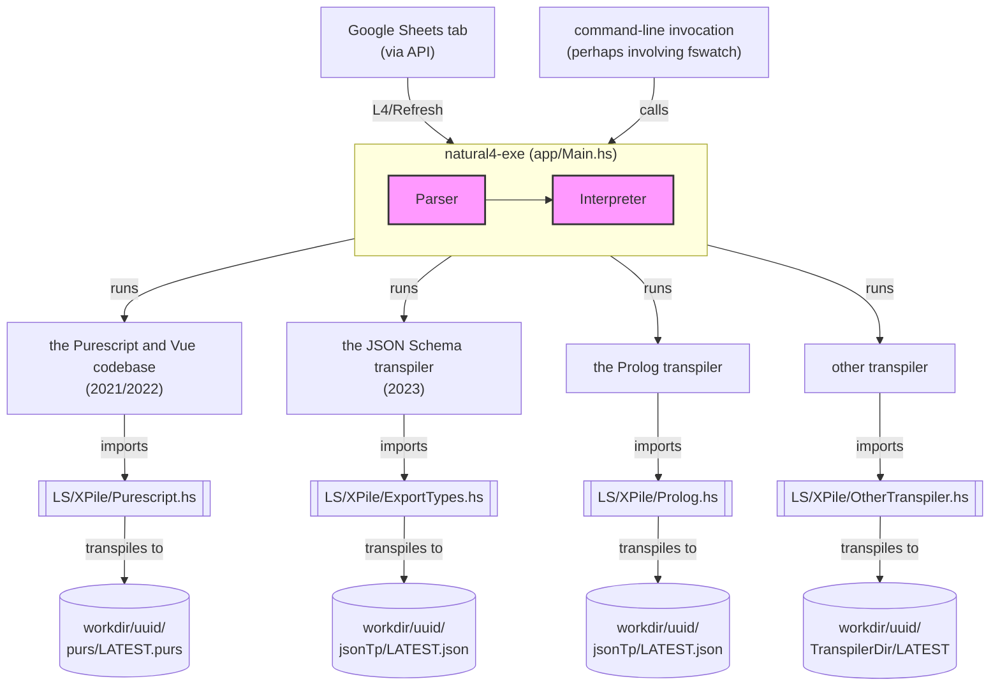

# [The Natural L4 codebase](https://github.com/smucclaw/dsl/tree/main/lib/haskell/natural4) #

## AST / CST ##

* [The `Rule` data structure](./rule_ast.md)

## The Natural L4 parser ##

The first-generation parser was based on BNFC: see

* [https://github.com/smucclaw/baby-l4/blob/main/l4.bnfc](https://github.com/smucclaw/baby-l4/blob/main/l4.bnfc)
* [https://bnfc.digitalgrammars.com/](https://bnfc.digitalgrammars.com/)

This work was done around 2020, 2021. It parsed text-file input.

The second-generation parser for the spreadsheet syntax was based on Megaparsec: see

> [https://github.com/smucclaw/dsl/blob/main/lib/haskell/natural4/src/LS/](https://github.com/smucclaw/dsl/blob/main/lib/haskell/natural4/src/LS/)

The monadic parser is slow. Profiling it with a flame graph shows that
a great deal of time is spent backtracking. The parser does a bunch of
lookahead and other work to deal with indentation. BNFC has native
support for "layout rule" logic. In this parser, we hacked up an
emulation of indentation-as-parenthesis, which doesn't work very well.
There is also a homegrown tracing engine that spits out megabytes of
logging info to help figure out what the parser is thinking.

[Many test
cases](https://github.com/smucclaw/dsl/blob/main/lib/haskell/natural4/test/Parsing/megaparsing/)
later, we still don't have full confidence in the parsing. For
example, trying to set up a `BoolStructR` that has a non-null `PrePost`
label can sometimes fail unintuitively when there is too much space or
not enough space between the label and the children.

The parser also hoists inline rules into top-level rules. This is the purpose of operating the parser within a Writer monad. See [tellIDFirst](https://github.com/smucclaw/dsl/blob/main/lib/haskell/natural4/src/LS/Tokens.hs#L1035-L1036).

## Meng's Analyzer / 'Interpreter' ##

After the input CSV is parsed into a collection of `Rule` types,
[Interpreter.hs](https://github.com/smucclaw/dsl/blob/main/lib/haskell/natural4/src/LS/Interpreter.hs)
attempts to analyze and reorganize it, to make it more ready for the
various transpilers to export from.

This is where rule substitution happens and simple rule rewriting/optimization.

This module is not really an interpreter. It should have been called an Analyzer.



## Module dependency graph ##

produced by

```bash
(base) ┌─[20240522-14:35:55]   [mengwong@rosegold:~/natural4/src/LS]
└─[0] <git:(main a0ecd7ff) > grep 'import LS' *.hs | grep -v -- '-- import' |  perl -ple 's/ \(.*//g; s/\.hs:import LS\.(.+)/ --> $1;/'
```



## Detailed function call graph ##

To produce this, run [function-call-graph](https://github.com/mengwong/function-call-graph)

```bash
(base) ┌─[20240522-14:28:22]   [mengwong@rosegold:~/natural4/src/LS]
└─[0] <git:(main a0ecd7ff) > fcall --clusters Lib.hs Parser.hs Utils.hs  Interpreter.hs RelationalPredicates.hs Rule.hs Tokens.hs Types.hs   > LS.dot
(base) ┌─[20240522-14:29:42]   [mengwong@rosegold:~/natural4/src/LS]
└─[0] <git:(main a0ecd7ff) > dot -Tsvg LS.dot > LS.svg
```



## Transpilers ##

Moving past the parser and analyzer stages, we come to the transpilers.



`Main.hs` runs a whole zoo of transpilers:

* [https://github.com/smucclaw/dsl/blob/main/lib/haskell/natural4/app/Main.hs#L185-L224](https://github.com/smucclaw/dsl/blob/main/lib/haskell/natural4/app/Main.hs#L185-L224)
* [https://github.com/smucclaw/dsl/tree/main/lib/haskell/natural4/src/LS/XPile](https://github.com/smucclaw/dsl/tree/main/lib/haskell/natural4/src/LS/XPile)

We have already talked about some of these, above -- MathLang and Petri.

We briefly visit a few others which are important for historical purposes, or whose functionality we want to see in a future version of the codebase.

### To Prolog (Prolog.hs) ###

* Status: Deprecated
* Context: According to Meng (16 May), he had written this as a way of thinking through the semantics of L4. The thought was apparently to get a translational semantics for L4 by working out what the corresponding Prolog should be.
* YM: In any case, even if you wanted to go to Prolog, the Logical English transpiler would probably be a better way of doing that.

### Logical English ###

I'll briefly note some in-the-weeds decisions about the implementation here (see [the system overview](../index.md) for a more high-level discussion).

Re Meng's Analyzer / 'Interpreter':

* This does not use the output from Meng's Analyzer / 'Interpreter'. Instead, it starts from the output from the parser.
* This is because
  * (i) it wasn't clear that the semantics that was implicit in Meng's Analyzer / 'Interpreter' was something that would be compatible with that for this fragment of L4.
  * (ii) it looked from a quick glance like some of the transformations that the analyzer/interpreter was doing might be lossy, e.g. there's some substitution or inlining
  * (iii) it wasn't clear what the specification for Meng's Analyzer / 'Interpreter' was; and in particular, what assumptions and guarantees it was making or providing.

It's also worth mentioning that there's a golden test framework in `dsl/lib/haskell/natural4/test/LS/XPile/LogicalEnglish` that Joe and Jo Hsi ahd worked on, and that we found helpful when developing this transpiler.

Finally, note that some of the comments in the LE transpiler codebase are out of date / out of sync with the code. Apologies about that --- I (YM) will try to clean that up soon.

### Maude ###

This was the subject of Joe's paper on the Contract as Automata work.

<https://www.researchgate.net/publication/375025000_Deontics_and_time_in_contracts_An_executable_semantics_for_the_L4_DSL>

### Logging ###

The `Intro*.hs` and `Logging.hs` files record a painful learning
journey toward monadic logging. The goal was to allow all transpilers
and all parts of the natural4 toolchain generally to be able to
produce structured logging for later debug inspection.

### Org ###

In parallel with structured logging we wrote a "transpiler to
org-mode" with a hierarchy best read in Emacs's org-mode.

### Purescript ###

The output of this transpiler is a Purescript representation of the boolstructs involved in the decision logic elements in L4 source input.

This Purescript output is consumed by the Vue web app.
