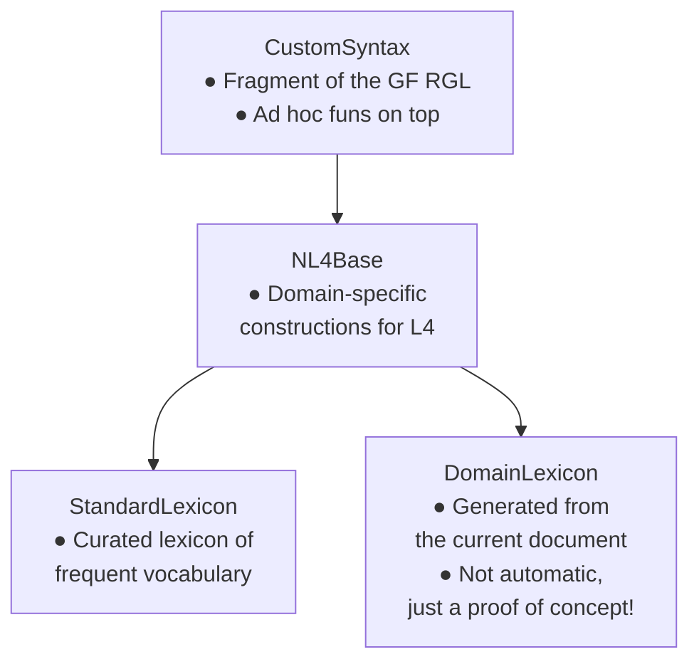

# NLG

This page documents the NLG system from early 2023, which is/was used by the [web form generation](../index.md#web-form-generation). The main goal was to convert the conditions in the rules into questions.

The code is in [natural4/src/LS/NLP/NLG.hs](https://github.com/smucclaw/dsl/blob/main/lib/haskell/natural4/src/LS/NLP/NLG.hs), and the grammars it uses are in [natural4/grammars](https://github.com/smucclaw/dsl/tree/main/lib/haskell/natural4/grammars).

## Input

The input is a spreadsheet such as the following, which has plenty of natural language in the cells.

| §          |  Assessment                                  |                        |               |                        |     |
|------------|----------------------------------------------|------------------------|---------------|------------------------|-----|
|EVERY       |Organisation                                  |                        |               |                        |     |
|WHICH       |NOT                                           |is                      |a Public Agency|                        |     |
|UPON        |becoming aware a data breach may have occurred|                        |               |                        |     |
|IF          |                                              |the data breach occurred|               |ON                      |1 Feb 2022|
|            |OR                                            |"                       |               |AFTER                   | "    |
|MUST        |                                              |assess                  |if it is a Notifiable Data Breach|      |      |

It is parsed into the [Rule](./rule_ast.md) datatype, where the different text fragments are parsed into different fields. So the line `NOT,is,a Public Agency` is a qualifier of the subject (`Organisation`), and because it is in that particular field, the system will parse it as a relative clause.

The other fields have their corresponding grammatical category as well. The action `assess,if it…` will be parsed as a verb phrase. The condition `the data breach occurred` is parsed as a full sentence, and if the sentence has a temporal condition (keywords `ON`, `AFTER` etc.), it's parsed into an adverbial.

## GF grammar

The fragments are parsed with a GF grammar with the following abstract syntax.

GF RGL is the Resource Grammar Library, which contains basic syntactic constructions for ~40 different languages. CustomSyntax takes a subset of those, and adds some specific constructions on top of it.
<!-- basic syntactic constructions like modification ("*small* cat", "sleep *furiously*"), complementation ("eat *food*", "distance *to Paris*"), predication ("the cat *is small*"). -->

These constructions were just added there by Inari based on the two example cases: PDPA and Rodents and Vermins. For example, the RGL doesn't support conjunction of prepositions like "on or after", so we added it into the CustomSyntax module.

We make some assumptions about which forms the fragments appear, for example, after `UPON`, there should be a verb phrase in gerund, not a full sentence with a subject. But these assumptions haven't been written down anywhere.

## Tree transformations to produce new natural language

After the different fields are parsed into GF trees, we can take their constituents and transform them into different trees.

The most successful application has been creating questions for the web form. For instance, `UPON,becoming aware that a data breach may have occurred` would become a question "have you become aware that a data breach may have occurred". We can assume that the subject is *you*, i.e. the person filling the web form. This is nice, because each of the conditions needs to be fulfilled in order for the whole rule to hold, and they get their own individual questions as full sentences.
<!-- (Since this is a tiny demo and so many things are already handcrafted, it's easy to make a rule that removes things like "become aware that", and just asks "has a data breach occurred?".) -->

There has always been the goal to create a full document from the spreadsheet version. Some prototypes have existed, but their problem has been that the sentences become very long. I (Inari) personally think that the original spreadsheet form is more readable, because it uses indentation and linebreaks. So if (/when) we want to create a full plain English document from the spreadsheet, we'll need to do something smarter than just concatenate the subtrees into larger trees.

## Lexicon generation

We (Maryam and Inari) also did some smaller experiments in generating the lexicon automatically, using an external parser via the Python NLP library [spaCy](https://spacy.io/). Probably the most up-to-date version of the code that generates GF lexica is [here in Inari's sandbox](https://github.com/smucclaw/sandbox/blob/default/inari/scasp/lex.py).

It was surprisingly good for getting the valencies of the verbs, but there was still a substantial amount of manual checking and correction needed. But given that the next use case didn't use the web app, this system was never needed in practice.

We also never automated the pipeline.

## Status

The current code and grammar are deprecated, but I (Inari) believe that there are ideas that are worth to salvage and develop further.

## Future goals

### Curated lexicon

Actually create a large curated lexicon (the module `StandardLexicon` [in the graph](#gf-grammar)). It should have at least some thousands of words, and probably in several modules, divided in subdomains.

### CNL

Make the natural language in the cells more controlled.
For instance, we could revisit Meng's "prepositional logic", like the example below.

|eat|noodles|
|---|-------|
|with|chopsticks|
|at|noon|

Unlike the all caps keywords of L4, should we have natural language keywords that we treat in a specific way when parsing?
