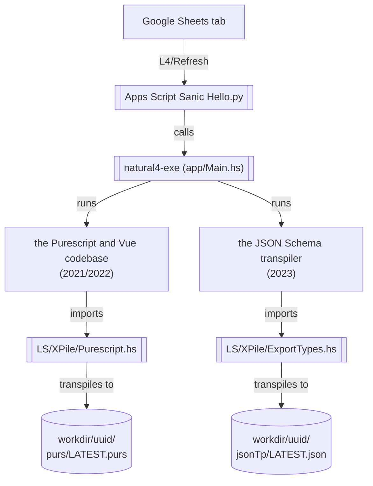

# Overview of the current system

As [the current user-facing documentation puts it](https://l4-documentation.readthedocs.io/en/stable/docs/links-returning-users.html),

> while there is one generic L4 syntax, L4 really admits of different fragments, each with their own specialized semantics, corresponding to the various transpilers. 

We'll systematically discuss each of these transpilers and their statuses when we [discuss the codebase in more detail](./codebase/index.md). But before doing that, let's briefly survey what I (YM) take to be the most currently functional components of the L4 ecosystem --- or, to put it another way, what one can currently do with L4.

## The (currently-most-functional) transpiler pipelines / components that don't involve visualization

### Web form generation

One useful thing you can do with L4 is to scaffold a web form app from an L4 specification.

There have been two generations of this app builder.

#### the Purescript and Vue codebase

The first generation built a Vue app from an encoding of the Personal Data Protection Act.

This app was internally titled "Dolora, the Law Explorer".

**Historical Context:** This was motivated by a 2021/2022 use case around the Personal Data Protection Act.

**Status:** Still forms part of current demos; badly needs to be superseded.

**Visible at:**

1. spreadsheet sidebar, at top.
2. A static snapshot of the generated app is stable and available at https://smucclaw.github.io/mengwong/pdpa

#### the JSON Schema transpiler

The second generation tried to separate MVC layers by using an approach based on [react-jsonschema-form](https://github.com/rjsf-team/react-jsonschema-form) / [vue-form-json-schema](https://github.com/jarvelov/vue-form-json-schema).

[The relevant docs](https://github.com/smucclaw/documentation/blob/main/docs/webform.rst) explain how the web form generation works in some detail. [The JSON schema transpiler docs](https://github.com/smucclaw/documentation/blob/main/docs/transpilers-json-schema.rst) are also relevant.

**Historical Context:** This was motivated by that use case with the insurance company. 

**Status:** Still relevant, 
* though YM thinks that there's quite a bit that could be improved, especially with regards to the interfaces (in the software design sense). 
* And ideally, we'd also want to re-examine the semantics of the schema definition constructs.
* The JSON Schema transpiler also needs some work. [TODO: Add more detail here on what kind of work]

**NOTE:** The [example form app repo](https://github.com/smucclaw/example-l4-form-app) needs some work. Haven't really bothered polishing it because we'll probably want to improve the web app generation system in more fundamental ways.

### The Logical English transpiler

[Docs for this can be found on the user-facing doc site](https://github.com/smucclaw/documentation/blob/main/docs/transpilers-logical-english.rst)

There are some ways in which the code for the transpiler could be cleaned up. But that work has been deferred for now, because it's not clear we want to be using this, going forward.

#### Historical Context

##### Motivation

This was motivated by that use case with the insurance company. 

If memory serves me right, we went for this because
* we thought that some form of logic programming would make for a good foundation for the system --- eg, it would be simple to extend it with facilities for abductive reasoning. (You could of course also do this with more work in Haskell.) And some of the designers/implementers of this dialect of L4 had a strong interest in logic programming.
* Logical English was especially convenient to build upon because it is a kind of CNL wrapper of Prolog -- it's basically Prolog with a natural-language-y facade. In that way, Logical English made it a lot easier to go from a CNL like Natural L4 to Prolog.

##### Reservations people had about this

Meng 
* did not like how it looked like we were piggybacking on another legal DSL
* did not like how the backend took longer than one might like (I cannot remember exactly how long) to handle requests. That said, YM and Joe would note that this is not a foundational issue but rather an engineering-level one --- it's something that can solved with some engineering effort.

YM also thinks, based in part on feedback from other members of the team, that the interfaces (in a software design sense) between the Logical English backend and the frontend / other callers could be improved and made more ergonomic. But this also is something that could probably be achieved with a reasonable amount of effort / time.

One might also have some reservations about how working with, eg., Swi-Prolog and having the client be totally in-browser and adding in more advanced Q&A functionality isn't trivial (though Joe has already worked this out).

Ultimately, though, YM's personal opinion is that there's no reason to hang on to this if we're overhauling things from the ground up.

#### Status

Depends on Meng, I guess. But I imagine we'll want to have this at least as a back up option, in case we don't have something else that can do at least as much when a usecase rolls around. 

### The MathLang system and transpiler

See "The 'Explainable' codebase" in the [codebase](./codebase/index.md) file.

### Natural Language Generation 

[TODO-Inari. Would be good to also reference / link to the examples where this gets used, eg in the dolora web app]

## Visualizations

The Natural L4 ecosystem also allows you to make useful visualizations from a L4 specification.

There is more detailed discussion of the relevant codebases for these sub-systems [in the Codebase section](./codebase/index.md). 

[TODO, high level]

## Natural L4 syntax specification

Finally, [a specification of sorts of the Natural L4 syntax is available here.](https://l4-documentation.readthedocs.io/en/stable/docs/returning-specification.html)
