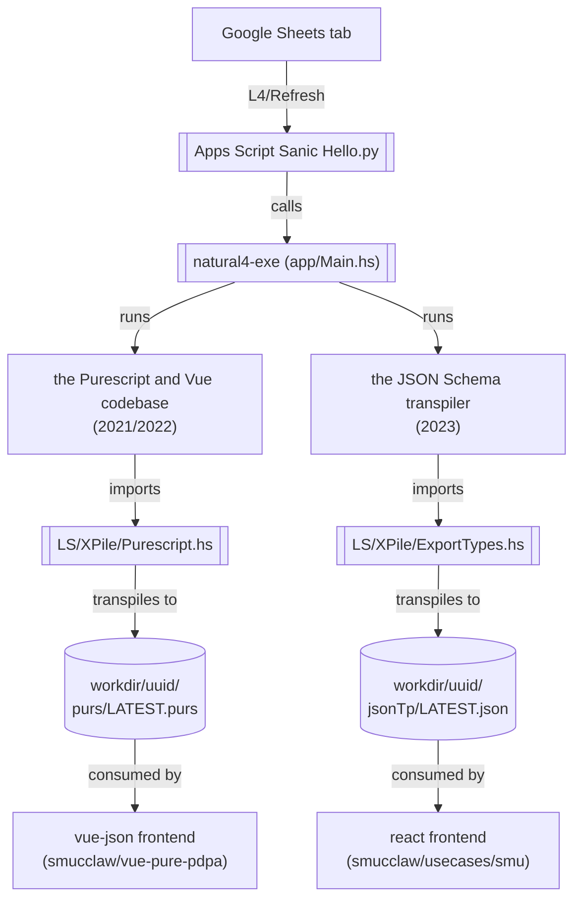
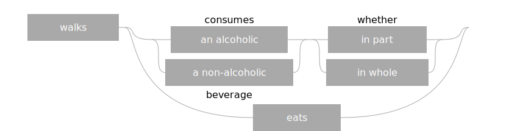
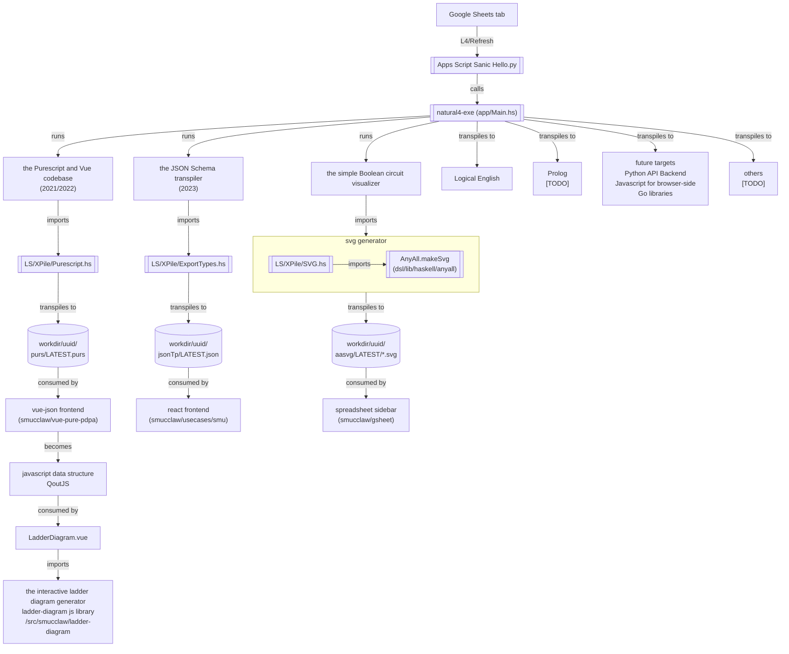

# Overview of the current system

As [the current user-facing documentation puts it](https://l4-documentation.readthedocs.io/en/stable/docs/links-returning-users.html),

> while there is one generic L4 syntax, L4 really admits of different fragments, each with their own specialized semantics, corresponding to the various transpilers.

We'll systematically discuss each of these dialects / transpilers and their statuses when we [discuss the codebase in more detail](./codebase/index.md). But before doing that, let's briefly survey what I (YM) take to be the most currently functional components of the L4 ecosystem --- or, to put it another way, what one can currently do with L4.

To clarify, this page aims to introduce the L4 ecosystem by highlighting the the most interesting things that can be done with it, and its key dialects. It does *not* discuss in-the-weeds details about the codebases or their architecture --- see the [Codebase section](./codebase/index.md) for that.

Starting from a Natural4 encoding of a set of legal rules, you can automatically:

* *parse* the spreadsheet CSV into an internal representation: see [codebase/natural4](./codebase/natural4.md)
* *generate* a web form "expert system" that interviews an end-user and returns a result.
  * The [simple version](#propositional-logic-only-decision-support-web-app-the-purescript-and-vue-codebase) of this only deals with propositional logic.
  * The [more complex version](#more-sophisticated-arithmetic--dates--some-abductive-queries) deals with numbers and dates too, using the [mathlang codebase](./codebase/generic_mathlang.md).
* *visualize* the **simple Boolean decision logic**, which is the subject of constitutive rules,
  * as a [black-and-white SVG ladder diagram](#simple-ladder-svgs)
  * as an [interactive HTML widget](#interactive-ladder-html)
* *visualize* the **state transition logic**, which is the subject of regulative rules,
  * as a [Petri Net](./codebase/visualizations.md#petri-net-stuff)
* *statically analyze* the state transition logic
  * using [Maude](./codebase/natural4.md#maude)

## Web form generation

One useful thing you can do with L4 is to scaffold a web form app from an L4 specification.

There have been two generations of this app builder.

### Propositional-logic-only decision support web app (the Purescript and Vue codebase)

The first generation builds a Vue web app that allows users to answer YES / NO questions to arrive at some sort of decision, and to see a visualization of that (see the discussion of ladder diagrams [TODO -- add links]). The most involved example of this involved making such an app from an encoding of the Personal Data Protection Act.

This is quite limited in its functionality: it only handles propositional logic.

This app was internally titled "Dolora, the Law Explorer".

#### Historical Context

This was motivated by a 2021/2022 use case around the Personal Data Protection Act.

#### Status

Still forms part of current demos; badly needs to be superseded.

#### Visible at

1. spreadsheet sidebar, at top.
2. A static snapshot of the generated app is stable and available at <https://smucclaw.github.io/mengwong/pdpa>

### More sophisticated (arithmetic + dates + some abductive queries)

[TODO: Reorganize and explain what this is first. 'separate MVC layers' probably not really getting at what's most interesting about the system. Link to further discussions of the JSON Schema transpiler + Clojurescript client]

The second generation tried to separate MVC layers by using an approach based on [react-jsonschema-form](https://github.com/rjsf-team/react-jsonschema-form) / [vue-form-json-schema](https://github.com/jarvelov/vue-form-json-schema).

[The relevant docs](https://github.com/smucclaw/documentation/blob/main/docs/webform.rst) explain how the web form generation works in some detail. [The JSON schema transpiler docs](https://github.com/smucclaw/documentation/blob/main/docs/transpilers-json-schema.rst) are also relevant.

There was also an abortive attempt at [trying to find a way to separate UI text from the web app](https://github.com/smucclaw/usecases/blob/c00a5162220ec9e3a062e7814a5310f9f0924c9a/jsonforms-vue-seed/README.md?plain=1).

#### Historical Context

This was motivated by that use case with the insurance company.

#### Status

Still relevant,

* though YM thinks that there's quite a bit that could be improved, especially with regards to the interfaces (in the software design sense).
* And ideally, we'd also want to re-examine the semantics of the schema definition constructs.
* The JSON Schema transpiler also needs some work. [TODO: Add more detail here on what kind of work]

**NOTE:** The [example form app repo](https://github.com/smucclaw/example-l4-form-app) needs some work. Haven't really bothered polishing it because we'll probably want to improve the web app generation system in more fundamental ways.

### The Logical English transpiler

TODO: Add discussion of what this is and how this is related to the web app stuff

[Docs for this can be found on the user-facing doc site](https://github.com/smucclaw/documentation/blob/main/docs/transpilers-logical-english.rst)

There are some ways in which the code for the transpiler could be cleaned up. But that work has been deferred for now, because it's not clear we want to be using this, going forward.

#### Historical Context

##### Motivation

This was motivated by that use case with the insurance company.

If memory serves me right, we went for this because

* we thought that some form of logic programming would make for a good foundation for the system --- eg, it would be simple to extend it with facilities for abductive reasoning. (You could of course also do this with more work in Haskell.) And some of the designers/implementers of this dialect of L4 had a strong interest in logic programming.

* Logical English was especially convenient to build upon because it is a kind of CNL wrapper of Prolog -- it's basically Prolog with a natural-language-y facade. In that way, Logical English made it a lot easier to go from a CNL like Natural L4 to Prolog.

##### Reservations people had about this

Meng

* did not like how it looked like we were piggybacking on another legal DSL (Logical English)

* did not like how the backend took longer than one might like (I cannot remember exactly how long) to handle requests. That said, YM and Joe would note that this is not a foundational issue but rather an engineering-level one --- it's something that can solved with some engineering effort.

YM also thinks, based in part on feedback from other members of the team, that the interfaces (in a software design sense) between the Logical English backend and the frontend / other callers could be improved and made more ergonomic. But this also is something that could probably be achieved with a reasonable amount of effort / time.

One might also have some reservations about how working with, eg., Swi-Prolog and having the client be totally in-browser and adding in more advanced Q&A functionality isn't trivial (though Joe has already worked this out).

Ultimately, though, YM's personal opinion is that there's no reason to hang on to this if we're overhauling things from the ground up.

#### Lessons

* For explainability, it might be enough, at least in the short run, to have some way, perhaps a DSL, for annotating with metadata the things we want to expose to downstream consumers, so that you can control what gets logged or 'explained', and maybe also the phrasing / *how* it gets explained.
  * To put it another way, there is a *prima facie* tension between wanting an encoding that (i) is faithful to the original text / legalistic, more technical concerns and yet (ii) can support explanations that are couched in less legalistic language and more understandable to ordinary users. Metadata facilities might be a good enough way to solve this.

#### Status

Depends on Meng, I guess. But I imagine we'll want to have this at least as a back up option, in case we don't have something else that can do at least as much when a usecase rolls around.

### The MathLang system and transpiler

TODO: Add 1-2 sentences explaining what this is

See "The 'Explainable' codebase" in the [codebase](./codebase/explainable.md) file.

### Natural Language Generation

The current codebase for NLG is in [natural4/src/LS/NLP/NLG.hs](https://github.com/smucclaw/dsl/blob/main/lib/haskell/natural4/src/LS/NLP/NLG.hs), and the grammars it is based on are in [natural4/grammars](https://github.com/smucclaw/dsl/tree/main/lib/haskell/natural4/grammars).

The NLG codebase was used by the [web form generation](#web-form-generation). The main goal was to convert the conditions in the rules into questions.

**For a longer description, see [NLG](./codebase/nlg.md).**

#### Status

This was in use for the PDPA use case and the Rodents and vermin demo, both from 2021/2022. In the insurance use case, we shifted to Logical English, and it didn't use the GF-based NLG at all.

We have ambitions to restart the NLG efforts—more in the dedicated page for [NLG](./codebase/nlg.md).

## Visualizations

The Natural L4 ecosystem also allows you to make useful visualizations from a L4 specification.

There is more detailed discussion of the relevant codebases for these sub-systems [in the Codebase section](./codebase/index.md).

### simple ladder SVGs

In 2020, simple Boolean-only decision logic was visualized with a library inspired by ladder logic Boolean circuit diagrams. See the [original specification in Google Drive](https://drive.google.com/drive/folders/1y7TssfA925VuyuAt8VBaNxlRTo8KyqlS?usp=sharing)

The tiny versions show up in the sidebar and look like this.

The fuller versions contain text and look like this.

### interactive ladder HTML

Subsequently, interns Jules and Zeming wrote an interactive version in HTML. See <https://github.com/smucclaw/ladder-diagram>

## Natural L4 syntax specification

Finally, [a specification of sorts of the Natural L4 syntax is available here.](https://l4-documentation.readthedocs.io/en/stable/docs/returning-specification.html)

## Overall Architecture Map

