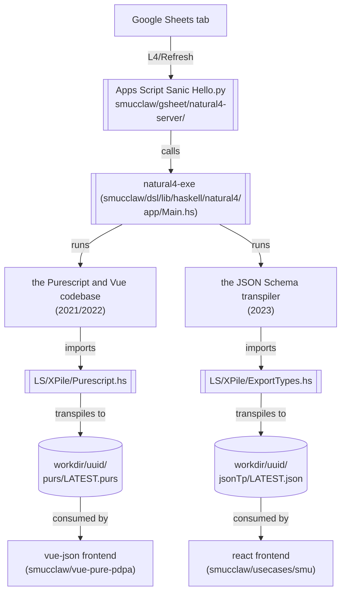

# Web form generation #

One useful thing you can do with L4 is to scaffold a web form app from an L4 specification.

There have been two generations of this app builder.

## Propositional-logic-only decision support web app ##

(the Purescript and Vue codebase)

The first generation builds a Vue web app that allows users to answer YES / NO questions to arrive at some sort of decision, and to see a visualization of that (see the discussion of ladder diagrams [TODO -- add links]). The most involved example of this involved making such an app from an encoding of the Personal Data Protection Act.

This is quite limited in its functionality: it only handles propositional logic.

This app was internally titled "Dolora, the Law Explorer".

### Historical Context ###

This was motivated by a 2021/2022 use case around the Personal Data Protection Act.

### Status ###

Still forms part of current demos; badly needs to be superseded.

### Visible at ###

1. spreadsheet sidebar, at top.
2. A static snapshot of the generated app is stable and available at <https://smucclaw.github.io/mengwong/pdpa>

## More sophisticated web form ##

(arithmetic + dates + some abductive queries)

[TODO: Reorganize and explain what this is first. 'separate MVC layers' probably not really getting at what's most interesting about the system. Link to further discussions of the JSON Schema transpiler + Clojurescript client]

The second generation tried to separate MVC layers by using an approach based on [react-jsonschema-form](https://github.com/rjsf-team/react-jsonschema-form) / [vue-form-json-schema](https://github.com/jarvelov/vue-form-json-schema).

[The relevant docs](https://github.com/smucclaw/documentation/blob/main/docs/webform.rst) explain how the web form generation works in some detail. [The JSON schema transpiler docs](https://github.com/smucclaw/documentation/blob/main/docs/transpilers-json-schema.rst) are also relevant.

There was also an abortive attempt at [trying to find a way to separate UI text from the web app](https://github.com/smucclaw/usecases/blob/c00a5162220ec9e3a062e7814a5310f9f0924c9a/jsonforms-vue-seed/README.md?plain=1).

### Historical Context ###

This was motivated by that use case with the insurance company.

### Status ###

Still relevant,

* though YM thinks that there's quite a bit that could be improved, especially with regards to the interfaces (in the software design sense).
* And ideally, we'd also want to re-examine the semantics of the schema definition constructs.
* The JSON Schema transpiler also needs some work. [TODO: Add more detail here on what kind of work]

**NOTE:** The [example form app repo](https://github.com/smucclaw/example-l4-form-app) needs some work. Haven't really bothered polishing it because we'll probably want to improve the web app generation system in more fundamental ways.
